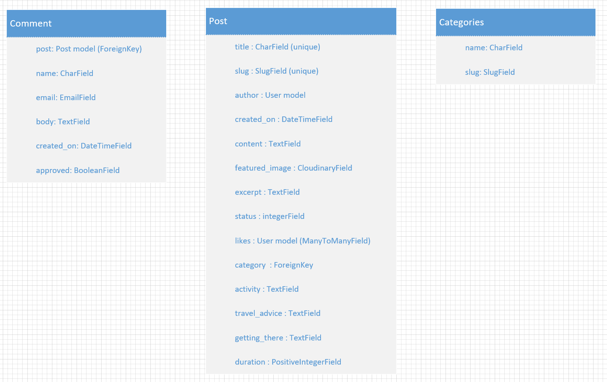

## Purpose of this site

Wild Atlantic Way travel blog is a public online blog-style platform where users can find information about places to visit.
Unregistered users can view the list of posts and select a post to view the full post and comments.
Registered users can create, update and delete their own post. They can also leave comments and like posts.

''

-By Eric Blake

# [Live site](https://wild-atlantic-way-c6d960b228a8.herokuapp.com/ "Live site")

## Table of Contents

## UX

### Strategy

* Build a simple, fun travel blog that will engage the user.

### Target Audience

* Anyone with an interest in travelling.

### User Goals

#### First Time User would like to

* Find out the purpose of the site and how to use it
* Be able to easily navigate throughout the site
* See a list of posts to see if the site is something they would be interested in
* See the top posts
* Filter post by category
* Be able to register for a user account

#### Registered User would like to

- Sign into their user account
* View posts and leave comments and likes
* Create their own post
* Edit and delete their own posts only
* Logout of their account to keep their account secure

#### Site Owner would like to

- Restrict access to non-registered users
* Control users posts and comments for inappropriate use of the site. All posts and comments must be approved by Admin before they are live on the site

### Agile Development Tool

I utilized a GitHub project and a [Kanban board].  As I start working on each issue I move it to the 'In progress' column.  When the coding for each issue has been completed, the issue is then moved to the 'done' column.

### User Stories

#### Must-Have

I used Github Issues to record the following user stories:
* [USER STORY: Account Registration](https://github.com/eric-blake/Wild-Atlantic-Way-Blog/issues/2)
* [USER STORY: Manage posts](https://github.com/eric-blake/Wild-Atlantic-Way-Blog/issues/3)
* [USER STORY: Open post](https://github.com/eric-blake/Wild-Atlantic-Way-Blog/issues/4)
* [USER STORY: View comments](https://github.com/eric-blake/Wild-Atlantic-Way-Blog/issues/5)
* [USER STORY: Comment on a post](https://github.com/eric-blake/Wild-Atlantic-Way-Blog/issues/6)
* [USER STORY: Like/Unlike post](https://github.com/eric-blake/Wild-Atlantic-Way-Blog/issues/7)
* [USER STORY: Site pagination](https://github.com/eric-blake/Wild-Atlantic-Way-Blog/issues/8)
* [USER STORY: Approve comments](https://github.com/eric-blake/Wild-Atlantic-Way-Blog/issues/9)
* [USER STORY: View likes](https://github.com/eric-blake/Wild-Atlantic-Way-Blog/issues/10)
* [USER STORY: View post list](https://github.com/eric-blake/Wild-Atlantic-Way-Blog/issues/11)
* [USER STORY: Create post](https://github.com/eric-blake/Wild-Atlantic-Way-Blog/issues/15)
* [USER STORY: Update post](https://github.com/eric-blake/Wild-Atlantic-Way-Blog/issues/16)
* [USER STORY: Delete post](https://github.com/eric-blake/Wild-Atlantic-Way-Blog/issues/17)
* [USER STORY: Post category](https://github.com/eric-blake/Wild-Atlantic-Way-Blog/issues/18)

#### Should-Have

- [USER STORY: View popular posts in sidebar](https://github.com/eric-blake/Wild-Atlantic-Way-Blog/issues/14)
* [USER STORY: View number of comments](https://github.com/eric-blake/Wild-Atlantic-Way-Blog/issues/13)

#### Could-Have

#### Wont-Have

- [USER STORY: Blog views](https://github.com/eric-blake/Wild-Atlantic-Way-Blog/issues/12)

## UX design

### Wireframe

I have used Mockflow to create the following wireframes for both desktop and mobile devices.

Page | Wireframe 
--- | --- 
Home page |  
About page | 
Post Detail page | 

### Structure & Logical Flow

The database model diagram was designed using Microsoft Visio

''

#### Post Model

* The main model that contains all the fields needed for the blog posts.
* This model is based on the "I think therefore I blog" walkthrough project. Some adjustments and additions were made to fit the needs of my project.

#### Comment Model

* Enable logged in users to add comments to different posts.
* Is based on the "I think therefore I blog" walkthrough project.

#### Category Model

* This is a custom model that enable users to see a list of categories.
* Users can filter popsts by category

### Colour Scheme

* The background colours is form of grey - rgba(240, 238, 238).
* The buttons use the standard bootstrap secondary button color.

### Fonts

The fonts used through out are Lato and Karla. These are a sans-serif fonts that are part of the Google font collection. They are professional and very readable fonts.

## Features

### Existing Features

#### Admin Page

#### Navbar

The navbar is basic so that it is very easy for the user to read.  The name of the website is the top left hand corner - Wild Atlantic Way Travel Blog. There are links to Home, About, Register and Login pages for all users. If the user is not signed in, the sign in and register links are visible on the navbar.

If the user is signed in, then there is a Logout link visible and a Create Post link.

The page that is being viewed is highlighted in the navbar so that the user can see easily what page they are on.

In mobile view the navbar is collapsed into a hamburger icon, which when clicked shows the same information as in desktop view.

#### Footer

The footer is simple layout with displaying social media options.  When an icon is clicked, it opens in a new tab so that the user still has the main site open.

#### Sidebar

* Categories
* Popular posts

#### About

#### Login and Register Pages

#### Create Post

#### Edit Post

#### Delete Post

#### Confirm Delete Pages

#### Comment form

#### Like post

### Future Features

#### Number of page views per post

#### Social media login

## Technologies Used

### Coding languages used

- HTML
* CSS
* Python
* JavaScript

### Frameworks and Libraries used

### External resources

* Microsoft Visio was used for the Flowchart.
* Heroku: Heroku is used to deploy the programme in the form of an app. This is supported by the Code Institute template that allows a python terminal to be run using a web page.
* Code Anywhere was used as the IDE to code the website.
* Code Institute template - To run the game in the terminal using Heroku.

### Libraries Used

* (random) was used to generate column number for the computers move.
* (time) was used to pause between player move and computer move.
* (sys) was used for the print slow function.
* (os) was used for the clear function.

## Testing

Detailed testing of the site can be found at [TESTING.md](TES).

Testing includes following:

* Validator testing
* Responsivness & Browser Compability Testing
* Manual Testing
* Automated Testing
* Testing of User Stories
* Lighthouse

## Bugs

* ### Fixed bugs

| Test | Result |
| ------------- | ------------- |
| Issue ...  | Updated g...... |

* ### Unfixed Bugs

No unfixed bugs

## Deployment and local development

### Deployment

* This project was deployed using Code Institutes mock Terminal for Heroku
* Steps for Deployment
  * From Heroku Dashboard, select Create new app from the dropdown menu.
  * Add a unique app name and then choose a region closest to you (EU or USA).
  * Click on Create App.
  * Go to support dependencies and select Add Buildpack.
  * The order of the buildpacks is important. Select Python first, then save changes. Then add Node.js second and save changes. If they are not in this order, you can drag them to rearrange them.
  * Add config VAR - key is PORT and the value is 8000.
  * Go to Deploy tab and select deployment method - Github, then click connect.
  * Enable automatic deploy so Heroku updates app each time changes are pushed to Github.
  * Click on View button to take you to your deployed link.

### Cloning the repository

The repository was cloned to my local PC. The steps to clone are as follows.

* In the Github repository, navigate to the main page of the repository.
* Click on the green Code button and copy the URL.
* Select Clone by HTTPS option.
* Open the code editor and within the terminal change the directory to the location you want to clone the repository to.
* Type git clone and paste the URL copied earlier.
* Press enter to create the local clone.

### Forking the repository

By forking the repository, you can make a copy of the repository and make changes without affecting the original repository. the steps to fork are as follows:

* Locate the repository in Github.
* On the top right corner of the page click Fork.
* A copy of the repository will now be created in your own repository.

## Credits

* Instructions throughout project was taken from [Code Institute](https://codeinstitute.net/ie/ "Code Institute") Django blog.
* Django Documentation
* The flowchart was created using Microsoft Visio.
* The Favicon was taken from [Icons8](https://icons8.com/ "Icons8").

## Acknowledgements

* Mitko Bachvarov. My mentor who provided me with advice and feedback throughout this project.
