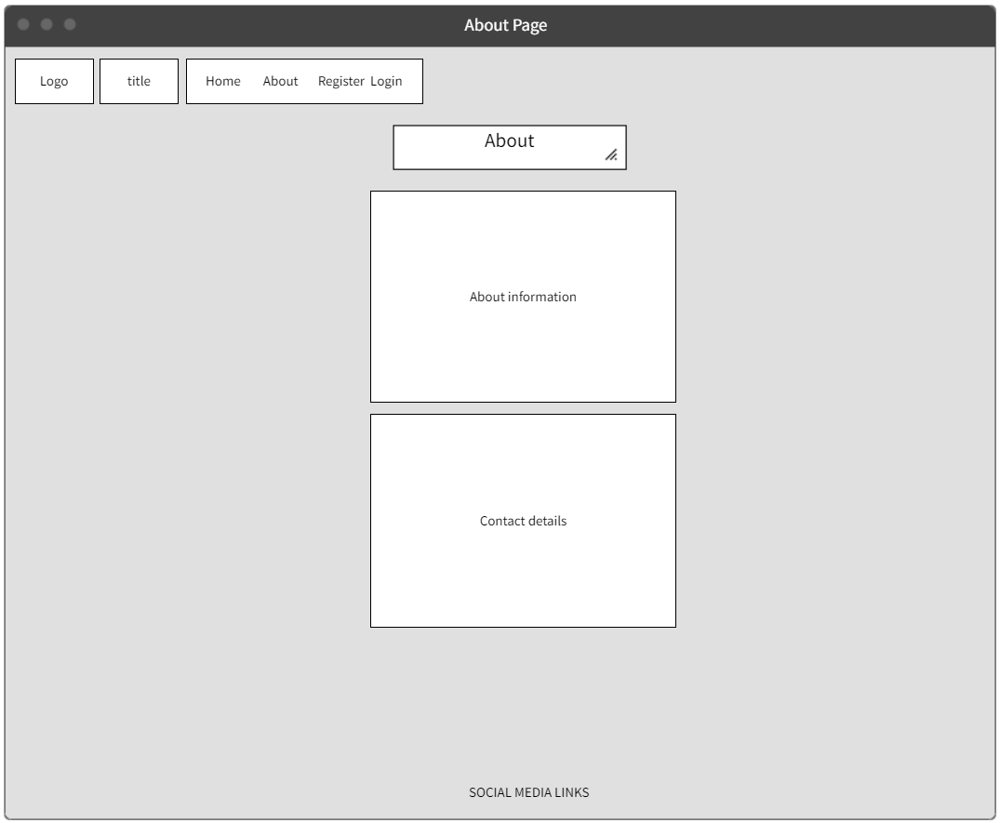
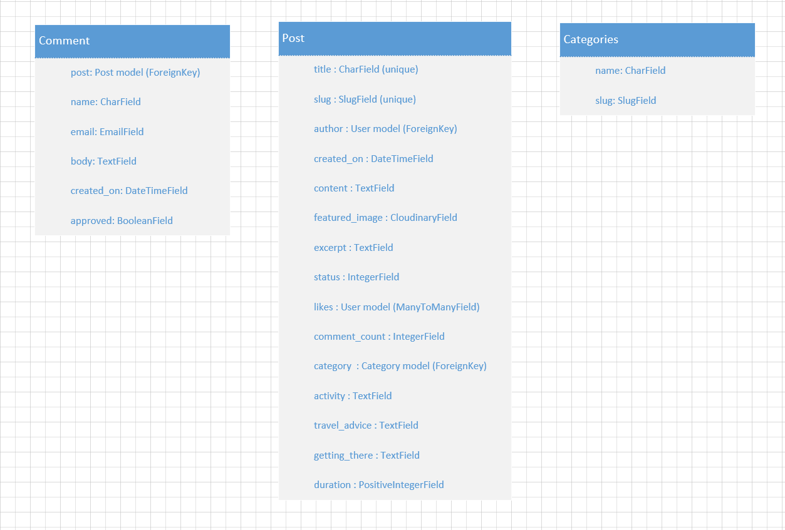

## Purpose of this site

Wild Atlantic Way travel blog is a public online blog-style platform where users can find information about places to visit.
Unregistered users can view the list of posts and select a post to view the full post and comments.
Registered users can create, update and delete their own post. They can also leave comments and like posts.

''

-By Eric Blake

# [Live site](https://wild-atlantic-way-c6d960b228a8.herokuapp.com/ "Live site")

## Table of Contents

## UX

### Strategy

* Build a simple, fun travel blog that will engage the user.

### Target Audience

* Anyone with an interest in travelling.

### User Goals

#### First Time User would like to

* Find out the purpose of the site and how to use it
* Be able to easily navigate throughout the site
* See a list of posts to see if the site is something they would be interested in
* See the top posts
* Filter post by category
* Be able to register for a user account

#### Registered User would like to

* Sign into their user account
* View posts and leave comments and likes
* Create their own post
* Edit and delete their own posts only
* Logout of their account to keep their account secure

#### Site Owner would like to

* Restrict access to non-registered users
* Control users posts and comments for inappropriate use of the site. All posts and comments must be approved by Admin before they are live on the site

### Agile Development Tool

I utilized a GitHub project and a [Kanban board].  As I start working on each issue I move it to the 'In progress' column.  When the coding for each issue has been completed, the issue is then moved to the 'done' column.

### User Stories

#### Must-Have

I used Github Issues to record the following user stories:
* [USER STORY: Account Registration](https://github.com/eric-blake/Wild-Atlantic-Way-Blog/issues/2)
* [USER STORY: Manage posts](https://github.com/eric-blake/Wild-Atlantic-Way-Blog/issues/3)
* [USER STORY: Open post](https://github.com/eric-blake/Wild-Atlantic-Way-Blog/issues/4)
* [USER STORY: View comments](https://github.com/eric-blake/Wild-Atlantic-Way-Blog/issues/5)
* [USER STORY: Comment on a post](https://github.com/eric-blake/Wild-Atlantic-Way-Blog/issues/6)
* [USER STORY: Like/Unlike post](https://github.com/eric-blake/Wild-Atlantic-Way-Blog/issues/7)
* [USER STORY: Site pagination](https://github.com/eric-blake/Wild-Atlantic-Way-Blog/issues/8)
* [USER STORY: Approve comments](https://github.com/eric-blake/Wild-Atlantic-Way-Blog/issues/9)
* [USER STORY: View likes](https://github.com/eric-blake/Wild-Atlantic-Way-Blog/issues/10)
* [USER STORY: View post list](https://github.com/eric-blake/Wild-Atlantic-Way-Blog/issues/11)
* [USER STORY: Create post](https://github.com/eric-blake/Wild-Atlantic-Way-Blog/issues/15)
* [USER STORY: Update post](https://github.com/eric-blake/Wild-Atlantic-Way-Blog/issues/16)
* [USER STORY: Delete post](https://github.com/eric-blake/Wild-Atlantic-Way-Blog/issues/17)
* [USER STORY: Post category](https://github.com/eric-blake/Wild-Atlantic-Way-Blog/issues/18)

#### Should-Have

* [USER STORY: View popular posts in sidebar](https://github.com/eric-blake/Wild-Atlantic-Way-Blog/issues/14)
* [USER STORY: View number of comments](https://github.com/eric-blake/Wild-Atlantic-Way-Blog/issues/13)

#### Could-Have

#### Wont-Have

* [USER STORY: Blog views](https://github.com/eric-blake/Wild-Atlantic-Way-Blog/issues/12)

## UX design

### Wireframe

I have used Mockflow to create the following wireframes for both desktop and mobile devices.

Page | Wireframe 
--- | --- 
Home page |  
About page | 
Post Detail page | 

### Structure & Logical Flow

The database model diagram was designed using Microsoft Visio

''

#### Post Model

* The main model that contains all the fields needed for the blog posts.
* This model is based on the "I think therefore I blog" walkthrough project. Some adjustments and additions were made to fit the needs of my project.

#### Comment Model

* Enable logged in users to add comments to different posts.
* Is based on the "I think therefore I blog" walkthrough project.

#### Category Model

* This is a custom model that enable users to see a list of categories.
* Users can filter popsts by category

### Colour Scheme

* The background colours is form of grey - rgba(240, 238, 238).
* The buttons use the standard bootstrap secondary button color.

### Fonts

* The fonts used through out are Lato and Karla. These are a sans-serif fonts that are part of the Google font collection. They are professional and very readable fonts.

## Features

### Existing Features

#### Admin Page
  

#### Navbar

* The navbar is basic so that it is very easy for the user to read.  The name of the website is the top left hand corner. There are links to Home, About, Register and Login pages for all users. If the user is not signed in, the sign in and register links are visible on the navbar.

  

* If the user is signed in, then there is a Logout link visible and a Create Post link.

* In mobile view the navbar is collapsed into a hamburger icon, which when clicked shows the same information as in desktop view.

#### Footer

* The footer is simple layout with displaying social media options.  When an icon is clicked, it opens in a new tab so that the user still has the main site open.

#### Sidebar

* The sidebar contains the categories filter and the popular post list.

* Clicking on a category will filter the post list by the selected category.
  

* Clicking on a post in the popular post list will open the post detail page.
  

#### About

* The about page is a simple page with text outlining the purpose of the site and an the contact details.
  

#### Register 

* The form enables users to register for an account.

#### Sign-in 

* The form enables users to register for an account.
  

#### Sign-out

* The form enables users to register for an account.

#### Create Post

* The form enables a signed in user to create a new post.
  

#### Update and Delele post

* A signed in user has access to the edit and delete buttons for their own posts. 
  

* A signed in not singed in will not have access to the edit and delete buttons.

#### Update Post

* When a user clicks on edit on the post list page they wull be redirected to the post form. The form will display the post details and the user can update details as required. 

* After making the required updates, the user will need to click on the update button to make the changes pernament.

#### Confirm Delete Post

* When the user clicks on the delete button they will be taken to teh confirm delete post page. The user can click on delete to pernamently delete the post, or click on back to return to the post list page. 

#### Comment form

* A signed in user can leave comments on all posts.
 

* After submitting a comment the user will receive a message informing them that their comment is awaiting approval. Site admin must approve comments before it is visible on the site.

* All users can see a list of previously approved comments
  

* All users can see the comment count for each post
 

#### Like post

* Signed in users can like a post, or unlike a post they have liked. 
* All users can see how many times a post has been liked.

* An unliked post will be a regular heart
  

* A liked post will be a solid heaart
  

### Future Features

* Number of page views per post
* Social media login
* Search Filters

## Technologies Used

### Coding languages used

* HTML
* CSS
* Python
* JavaScript

### Frameworks and Libraries used

#### Django
* Framework used to build this project. Provides a built in admin panel and includes many helper template tags that make writing code quick and efficient.

#### Django-Allauth
* Used for User authenticaion (register, login and logout).

#### Django Crispy Forms
* Used to control rendering of Django forms.

#### ElepantSQL
* The database used by the deployed project on Heroku.
  
#### psycopg2
* PostgreSQL database adapter for the Python programming language.

#### Gunicorn
* Python HTTP server for WSGI applications.

#### Summernote
* WYSIWYG editor. Used for comment form.

#### Cloudinary
* The cloud platform used to store static media files.

#### Mockflow
* Used for the wireframes

#### Git
* Used for version control.

#### CodeAnywhere
* Used as the IDE to code this website.

#### Heroku
* The cloud platform used to deploy the project in the live environment.

#### Bootstrap
* The front end development framework used for styling along with custom CSS.
  
#### Microsoft Visio
* Used for the entity relationship diagram

## Testing

Detailed testing of the site can be found at [TESTING.md](TES).

Testing includes following:

* Validator testing
* Responsivness & Browser Compability Testing
* Manual Testing
* Automated Testing
* Testing of User Stories
* Lighthouse

## Bugs

* ### Fixed bugs

| Test | Result |
| ------------- | ------------- |
| Issue ...  | Updated g...... |

* ### Unfixed Bugs

No unfixed bugs

## Deployment and local development

### Deployment

#### This project was deployed using Code Institutes mock Terminal for Heroku
* Steps for Deployment
  * From Heroku Dashboard, select Create new app from the dropdown menu.
  * Add a unique app name and then choose a region closest to you (EU or USA).
  * Click on Create App.
  * Go to support dependencies and select Add Buildpack.
  * The order of the buildpacks is important. Select Python first, then save changes. Then add Node.js second and save changes. If they are not in this order, you can drag them to rearrange them.
  * Add config VAR - key is PORT and the value is 8000.
  * Go to Deploy tab and select deployment method - Github, then click connect.
  * Enable automatic deploy so Heroku updates app each time changes are pushed to Github.
  * Click on View button to take you to your deployed link.

### Cloning the repository

The repository was cloned to my local PC. The steps to clone are as follows.

* In the Github repository, navigate to the main page of the repository.
* Click on the green Code button and copy the URL.
* Select Clone by HTTPS option.
* Open the code editor and within the terminal change the directory to the location you want to clone the repository to.
* Type git clone and paste the URL copied earlier.
* Press enter to create the local clone.

### Forking the repository

By forking the repository, you can make a copy of the repository and make changes without affecting the original repository. the steps to fork are as follows:

* Locate the repository in Github.
* On the top right corner of the page click Fork.
* A copy of the repository will now be created in your own repository.

## Credits

* Instructions throughout project was taken from [Code Institute](https://codeinstitute.net/ie/ "Code Institute") Django blog.
* Django Documentation
* The flowchart was created using Microsoft Visio.
* The Favicon was taken from [Icons8](https://icons8.com/ "Icons8").

## Acknowledgements

* Mitko Bachvarov. My mentor who provided me with advice and feedback throughout this project.
